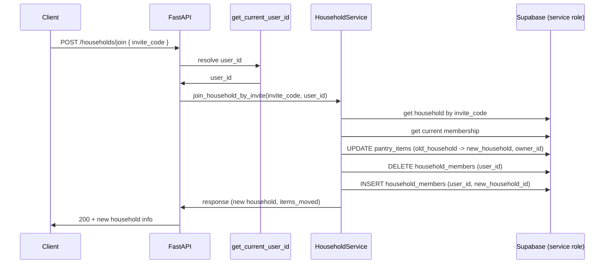

# Join Household and Pantry Item Migration Plan

## Problem

- Each user is in exactly one household at a time (`household_members.user_id` is UNIQUE).
- Users start in a personal household (created automatically) and may later join a shared household via invite code.
- When the user **joins another household**, their current membership is replaced (delete old row, insert new). Pantry items remain tied to the **old** `household_id`, so:
  - The user’s items are left in a household they no longer belong to and disappear from their view.
  - Queries use `get_current_household_id()`, so only the new household is visible.

So we need a **join** flow that: (1) validates the invite and target household, (2) **migrates the user’s pantry items** from the current household to the target household, (3) **switches membership** (remove old, add new). Optionally, support **leave household** (return to personal) with the same idea: move the user’s items to a (new or existing) personal household, then switch membership.

---

## Approach

- **Join household by invite code:** In one logical flow (preferrably transactional where possible):
  1. Resolve target household by `invite_code` (and ensure it is not personal, if desired).
  2. Get current membership (current `household_id`).
  3. **Migrate items:** `UPDATE pantry_items SET household_id = :new_household_id WHERE household_id = :old_household_id AND owner_id = :user_id`.
  4. **Switch membership:** delete row in `household_members` for this `user_id`, then insert new row for `(user_id, new_household_id)`.
- **RLS:** The update touches rows in the old household and assigns them to the new household; the delete/insert change membership. With the **anon** key, RLS may block the bulk update (e.g. updating to a household the user is not yet in) or the delete. So the **join (and optionally leave) flow should use the Supabase service role client** for the migration and membership changes, while the request is still **authenticated** (e.g. `get_current_user_id`). Only the server performs the move; the client just calls “join by invite code”.
- **Leave household (return to personal):** Create (or reuse) a personal household, migrate the user’s items from current household to that household, then switch membership (delete current, insert personal). Reuse existing `HouseholdLeaveResponse` (`new_household_id`, `new_household_name`, `items_deleted`).

---

## Implementation

### 1. Backend: Household service – join by invite code

**File:** [app/services/house_hold_service.py](app/services/house_hold_service.py)

- Add a method `join_household_by_invite(invite_code: str, user_id: UUID)` (or accept `HouseholdJoinRequest` and `user_id`).
- **Steps:**
  - **Resolve target household:** Query `households` by `invite_code` (normalize to uppercase). If not found or `is_personal` is true, return 400/404 (do not allow joining a “personal” household by code).
  - **Current membership:** Query `household_members` by `user_id`; get `household_id`. If already in this household, return 400 “Already in this household”.
  - **Migrate pantry items:** Using **service role** Supabase client:  
  `update pantry_items set household_id = :new_id, updated_at = now() where household_id = :old_id and owner_id = :user_id`.  
  Count updated rows for response if desired.
  - **Switch membership:** With same client: delete from `household_members` where `user_id = :user_id`; insert into `household_members` (`user_id`, `household_id`, `joined_at`) for the new household.
- **Optional:** If the old household was personal (`is_personal = true`) and has no other members, you can delete that household row (or leave it for a future “return to personal” that reuses it). Prefer leaving it unless product explicitly wants to delete empty personal households.
- Return a response that includes the new `household_id` and optionally number of items moved.

**Dependency:** The service method should accept a **service role** Supabase client for the join (and leave) operations, or the router injects it only for these endpoints. Existing `HouseholdService(supabase)` can be extended with an optional second client, or the join/leave logic can use a separate “admin” service that takes the service role client.

### 2. Backend: Household service – leave household (return to personal)

**File:** [app/services/house_hold_service.py](app/services/house_hold_service.py)

- Add `leave_household(user_id: UUID)` (or similar).
- **Steps:**
  - Get current membership and current `household_id`; if not in any, return 400.
  - **Create or get personal household:** Either create a new household with `is_personal = true`, `owner_id = user_id`, and a unique `invite_code` (e.g. random), or reuse an existing personal household for this user (e.g. one with `owner_id = user_id` and `is_personal = true`). Depends on whether “personal” is created once per user (e.g. by trigger on signup) or created on first “leave”. If the DB/trigger already creates a personal household on signup, you might not have one when user previously “joined” another (they left it). So “leave” = create a new personal household, then move items and switch membership.
  - **Migrate items:** Same as join: update `pantry_items` set `household_id = :personal_household_id` where `household_id = :current_household_id` and `owner_id = :user_id` (using service role).
  - **Switch membership:** Delete current `household_members` row, insert new one for the personal household.
- Return `HouseholdLeaveResponse` with `new_household_id`, `new_household_name`, and optionally `items_deleted` (or items_moved).

### 3. Backend: Router and dependencies

- **Household router:** Add a new router (e.g. `app/routers/household.py`) with:
  - `POST /households/join` (or `POST /households/join-by-invite`): body `HouseholdJoinRequest` (invite_code); dependency `get_current_user_id`; call `HouseholdService.join_household_by_invite` (passing a **service role** client for the actual DB work).
  - `POST /households/leave`: no body (or optional); dependency `get_current_user_id`; call `HouseholdService.leave_household`.
- **Dependency:** For join/leave only, inject `get_supabase_service_role_client` into the household service (or a dedicated “household admin” flow) so migration and membership changes bypass RLS. Keep using `get_current_user_id` so only authenticated users can call these endpoints.

### 4. Supabase (schema / RLS)

- **No schema change required** for the basic fix: `household_members` (one row per user) and `pantry_items` (household_id + owner_id) already support “move items then switch membership.”
- **RLS:** Ensure your policies allow the **service role** to update/delete/insert as needed (service role bypasses RLS). If you ever do this with the anon key (not recommended for this flow), you’d need policies that allow the owner to update `pantry_items` to change `household_id` when joining/leaving, which is more complex and error-prone.
- **Trigger:** The existing `household_after_insert_member_trigger` runs after INSERT on `households`; it does not run on `household_members`. So creating a new personal household on “leave” is just an insert into `households` plus insert into `household_members`; no change needed to the trigger unless you want to auto-create a personal household when a user is created (separate from this plan).

### 5. FastAPI app registration

- In [app/main.py](app/main.py), `include_router` the new household router (e.g. `household_router` with prefix `/households` or as you prefer).

---

## Flow summary

---

## Edge cases and notes

- **Already in target household:** Check after resolving by invite_code; return 400 with a clear message.
- **Invalid invite code:** Return 404 or 400.
- **Personal household:** Do not allow joining a household that is `is_personal = true` via invite code (treat as invalid or 400).
- **Empty personal household:** After join, the old (personal) household may have no members. You can leave it in place for a future “leave and return to personal” (reuse same row) or delete it; document the choice.
- **Leave when already in personal:** Either forbid (400) or no-op; document.
- **Embeddings:** `pantry_items` has a trigger `sync_pantry_embedding` on insert/update. Updating `household_id` (and `updated_at`) will fire the trigger; no extra work needed for embeddings.

---

## Files to add or change

| File                                                                     | Action                                                                                                            |
| ------------------------------------------------------------------------ | ----------------------------------------------------------------------------------------------------------------- |
| [app/services/house_hold_service.py](app/services/house_hold_service.py) | Add `join_household_by_invite`, optionally `leave_household`; use service role client for migration + membership. |
| [app/routers/household.py](app/routers/household.py)                     | New router: `POST /join`, `POST /leave`; depend on `get_current_user_id` and service role client where needed.    |
| [app/main.py](app/main.py)                                               | Register household router.                                                                                        |
| [app/routers/**init**.py](app/routers/__init__.py)                       | Export `household_router` if you use a single export list.                                                        |

No Supabase schema or migration is required for the core behavior; the fix is entirely in the FastAPI service and router plus using the existing service role client for the move and membership update.